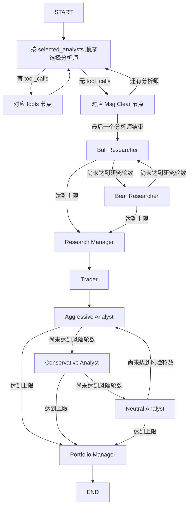

# TradingAgents 基础设施替换说明

本次重构以提交 `2d17df8` 为基线，保留 TradingAgents 的结构和业务行为，将 LangGraph / LangChain 替换为项目内基础组件。没有增加 Agent、策略、数据源或调度服务。

## 1. 原有架构

`TradingAgentsGraph` 创建 quick/deep 两个模型、现有工具节点、路由器、GraphSetup、Propagator、Reflector、SignalProcessor 和 TradingMemoryLog。GraphSetup 按调用者的 `selected_analysts` 顺序组装图。

实际业务 Agent 共 12 个：Market、Sentiment、News、Fundamentals，Bull、Bear、Research Manager、Trader，Aggressive、Conservative、Neutral、Portfolio Manager。`social_media_analyst` 是 Sentiment 的兼容入口，不是额外 Agent。默认图注册 20 个节点：12 个业务节点、4 个工具节点、4 个消息清理节点。

数据源位于 `dataflows/`，包含 Yahoo Finance、Alpha Vantage、FRED、Polymarket、StockTwits、Reddit、SEC EDGAR 等。它们及供应商路由、日期边界、缓存逻辑保持原样。

## 2. 原 LangGraph 的职责

| 实际职责 | 原调用位置 | 内部替代 |
| --- | --- | --- |
| 注册节点、普通边、条件边、循环 | `graph/setup.py` | `runtime/graph.py` |
| 合并 State、消息 reducer | `agents/utils/agent_states.py` | `runtime/graph.py`、`runtime/messages.py` |
| 工具批次执行与日期注入 | `graph/trading_graph.py`、`agents/utils/*_tools.py` | `runtime/tools.py` |
| invoke、逐节点状态流、步数上限 | `graph/propagation.py`、CLI、`propagate()` | `GraphExecutor` |
| SQLite 中断恢复 | `graph/checkpointer.py` | `runtime/checkpoint.py` |

图始终只有一个活动业务节点。当前业务不使用并行图分支、子图、动态任务、人工 interrupt、远程 Store、异步图执行或 token 级图流，因此未实现这些能力。工具批次内部仍可并发执行，结果按模型给出的调用顺序回填。

## 3. 原 LangChain 的职责

Message 类型、Prompt 模板/占位符、工具参数 Schema、`bind_tools`、LLM Provider 适配、结构化输出解析以及 CLI 的 LLM/tool/token 统计原由 LangChain 承担。

现在 `runtime/messages.py` 定义 Human/System/AI/Tool/RemoveMessage；`runtime/prompts.py` 只实现当前使用的模板替换和模型组合；`runtime/tools.py` 从原函数签名生成同样的模型可见 Schema；`llm_clients/chat_model.py` 提供 invoke、不可变绑定、Pydantic 结果解析；`runtime/callbacks.py` 传递现有统计事件。

没有增加通用 Agent 基类。现有 Agent factory 仍返回读取 State、调用模型、返回局部 State 更新的函数，GraphExecutor 直接执行这些函数。

## 4. 完整执行链



研究路由在 `count >= 2 * max_debate_rounds` 时转向 Research Manager；否则根据 `current_response` 的 Bull 前缀选择另一方。风险路由在 `count >= 3 * max_risk_discuss_rounds` 时转向 Portfolio Manager，否则按 `latest_speaker` 的前缀在三方间轮转。完整 path map 和兜底结果保留。计数检查发生在节点执行之后，包括配置轮数为 0 时先执行首次发言的原有行为。

Sentiment 正常路径不进行工具循环：它直接预取 News、StockTwits 和 Reddit，将内容注入原 Prompt，再请求结构化报告。`tools_social` 和对应条件边仍按原图注册。

原工具列表中的细节也保留：News 模型绑定 4 个工具，News 执行节点额外注册已有的 insider 工具；Market 执行节点包含 verified snapshot。消息清理节点仍删除本分析阶段的消息，并追加包含标的身份的 HumanMessage。

## 5. State、Message 和 Tool 的关系

AgentState 的 17 个字段保持原样：`messages`、`company_of_interest`、`asset_type`、`instrument_context`、`trade_date`、`sender`、4 个报告字段、`investment_debate_state`、`investment_plan`、`trader_investment_plan`、`risk_debate_state`、`final_trade_decision`、`past_context`、`portfolio_context`。

普通字段按节点返回值覆盖；辩论嵌套字典也整体覆盖，不做递归合并。`messages` 是唯一业务 reducer：新 ID 追加、已有 ID 替换、RemoveMessage 按 ID 删除。消息 ID 在进入 State 时补齐，CLI 继续依赖 ID 去重。

模型返回 `{name, args, id}` 工具调用。ToolRegistry 按原函数名查找工具，ToolExecutor 从 State 注入 `trade_date`，参数中伪造的日期无法覆盖 State。注入字段不出现在模型 Schema 中，直接调用 `.func()` 的行为不变。工具返回 ToolMessage，并保留调用 ID、工具名和成功/错误状态。

未知工具和参数验证错误回填错误消息；数据源执行异常仍向上传播，使分析失败并保留 checkpoint。多个工具可并发运行，返回消息顺序与请求顺序一致。原有数据工具实现、参数含义和日期裁剪逻辑未改动。

## 6. 耦合点与 Provider 保留能力

业务修改主要是将 Message、Prompt、Tool、InjectedState、StateGraph 和 ToolNode 的导入指向内部模块。Agent Prompt、状态更新函数、GraphSetup 的节点和边、ConditionalLogic 的路由、Backtest 和报告逻辑保持不变。

| Provider | 内部适配 | 保留内容 |
| --- | --- | --- |
| OpenAI 与兼容 Provider | `sdk_openai.py` | Chat Completions、原生 OpenAI Responses、工具绑定、结构化结果、temperature/reasoning/max_tokens/retry 转发 |
| DeepSeek / MiniMax / 本地兼容服务 | 原 `openai_client.py` 子类 + SDK transport | reasoning_content 往返、reasoning_split、按能力省略 tool_choice、原 endpoint 与 key 规则 |
| Azure | `sdk_openai.py` 的 Azure adapter | deployment、endpoint、API version、Azure SDK 身份验证 |
| Anthropic | `sdk_anthropic.py` | Messages API、tool_use/tool_result、effort、已知模型输出上限、原 timeout 默认值、内容归一化 |
| Google | `sdk_google.py` | generateContent、thinking_level、JSON Schema、函数结果、原 retry 参数语义 |
| Bedrock | 可选 `sdk_bedrock.py` | Converse、工具结果、AWS 凭据链和优先的 bearer token |

SDK 请求响应中的 Responses reasoning items、Anthropic thinking signature、Google thought signature、Bedrock reasoning blocks 保存在 Message 的额外数据中，工具往返与 checkpoint 序列化后仍可使用。业务读取的 `content` 继续归一化为文本。

`with_structured_output` 继续返回 Pydantic 实例。Sentiment、Research Manager、Trader、Portfolio Manager 原有的 schema、Markdown renderer，以及绑定不支持或解析失败时的 free-text fallback 均保留。没有改变最终输出：`propagate()` 仍返回 `(final_state, signal)`，最终决策字段仍为 Markdown，signal 为五档评级或 `REVIEW`。

## 7. 替代架构、流与 checkpoint

```text
CLI / Backtest / TradingAgentsGraph
  └─ 原 Agent factories + GraphSetup + ConditionalLogic
       ├─ runtime/graph.py：单节点 executor、State merge、路由、invoke/stream
       ├─ runtime/checkpoint.py：SQLite 原子保存 State + next_node + step
       └─ runtime/messages.py / prompts.py / callbacks.py
            ├─ llm_clients/chat_model.py + sdk_*.py → 原生 Provider SDK
            └─ runtime/tools.py → 原工具函数 → 原 dataflows
```

`stream(..., stream_mode="values")` 在开始和每个成功节点后提供完整 State 快照。CLI 和 debug 路径继续消费此模式；`invoke()` 返回最终 State。`updates` 模式提供节点名及局部更新，便于执行轨迹测试。步数上限继续通过 `config.recursion_limit` 控制。

SQLite 在初始状态和每个成功节点后提交一个快照，包含类型化消息、下一节点和累计步数。`invoke(None)` / `stream(None)` 加载快照，从尚未完成的节点继续；不重复合并初始 HumanMessage。ticker/date/分析师顺序/辩论深度/asset/portfolio 的原 thread 签名算法保持不变。成功清理、失败保留、CLI 与 propagate 共用的 begin/end 生命周期保持不变。

**跨版本 checkpoint 限制**：新格式是版本化 JSON，不解释旧框架的内部 checkpoint 格式。发现同一 thread 的旧 checkpoint 时明确报错并保留原文件。可用旧版本完成该次分析，或由调用者显式使用 `--clear-checkpoints` 开始新分析。本次没有自动删除或转换用户的旧 checkpoint，也没有引入旧框架序列化依赖。

## 8. 新增和修改的核心文件

- 新增 `runtime/{graph,messages,prompts,tools,callbacks,checkpoint}.py`。
- 新增 `llm_clients/chat_model.py` 和 `sdk_{openai,anthropic,google,bedrock}.py`；原 Provider factory、注册表、模型目录和能力分派继续使用。
- 修改原图/Agent/工具/CLI 的基础设施导入；`graph/checkpointer.py` 改为使用内部 SQLite saver；删除包入口针对旧框架的 warning workaround。
- `pyproject.toml` 改为直接依赖原生 SDK 与 Pydantic；`requirements.txt` 继续引用本项目，Bedrock extra 改为 boto3。
- 新增运行时、SDK transport 和基线回放测试，补充现有测试的导入与可选依赖目标。

## 验证依据与范围

基线保存在 `tests/fixtures/`：

- `runtime_reference.json`：从原实现捕获 4 组固定响应执行。比较节点顺序、条件路由、工具绑定、供应商参数、所有模型 Prompt 的 SHA-256、逐步 State 的 SHA-256 和完整最终 State。覆盖默认顺序、重排分析师、2 轮辩论、仅 Sentiment 和 0 轮配置。
- `tool_schemas.json`：12 个现有工具的原模型可见 Schema。
- `provider_reference.json`：原 OpenAI、DeepSeek、MiniMax、本地兼容、Anthropic 的 10 组结构化请求参数，覆盖 Responses 和推理/采样设置。
- `business_reference.json`：31 个业务文件的 AST 摘要（仅排除 import 与模块文档字符串），以及 25 个数据源/Backtest/Portfolio/Reporting 文件的文本摘要。用于确认 Prompt、节点连接和数据逻辑没有随替换变动。

新增测试还覆盖真实原生 SDK 的 HTTP 序列化/解析（本地 mock transport）、工具往返、token 统计、重试、结构化解析失败回退、Bedrock 请求签名、消息删除/替换、并发工具返回顺序、隐藏日期注入、SQLite 重开恢复和循环上限。SDK 测试不发送真实模型请求。

Python 3.13 的独立 `.venv` 从项目新依赖安装，`pip check` 通过，环境中的发行包不含 LangGraph/LangChain。运行：

```powershell
.\.venv\Scripts\python.exe -m pytest -q -m "not integration"
.\.venv\Scripts\python.exe -m ruff check .
.\.venv\Scripts\tradingagents.exe --help
.\.venv\Scripts\tradingagents.exe backtest --help
```

基线全量测试已有 3 项失败，均来自 `test_ohlcv_cache_freshness.py`：测试将固定的无时区 NOW 转成 epoch 写入 mtime，业务再按本机时区读取，Asia/Shanghai 环境下发生偏移。重构后仍是同样的失败；本次没有修改数据源或放宽这些断言。另有 3 项 POSIX 权限测试在 Windows 跳过，真实 Provider 集成测试未运行。

2026-09-23 最终验证：**978 passed、3 failed（上述基线失败）、3 skipped、1 deselected**，另有 88 个 subtest 通过。原基线是 941 passed、相同的 3 failed/3 skipped/1 deselected。Ruff、依赖一致性检查、CLI `--help` 和 `backtest --help` 均通过，阻止所有框架导入的入口加载测试通过。

完整测试输出：[重构前基线](validation/baseline-tests.txt)、[重构后验证](validation/final-tests.txt)。

测试环境为 Python 3.13.0、OpenAI SDK 3.17.0、Anthropic SDK 1.7.0、Google GenAI 2.24.0、boto3 1.43.99、Pydantic 2.13.5；新依赖的 SDK 版本边界沿用基线适配器要求的范围。干净环境中不存在 LangGraph/LangChain 发行包。

接口核对使用原依赖的已安装代码和原生 SDK，并参考 [OpenAI function calling](https://developers.openai.com/api/docs/guides/function-calling)、[Gemini function calling](https://ai.google.dev/gemini-api/docs/function-calling)、[Anthropic tool use](https://docs.anthropic.com/en/docs/agents-and-tools/tool-use/implement-tool-use)、[Bedrock Converse](https://boto3.amazonaws.com/v1/documentation/api/latest/reference/services/bedrock-runtime/client/converse.html)。真实供应商在线兼容性仍需在用户选择的 endpoint/model 上验证，离线测试不代表已经完成实盘或在线回测。
